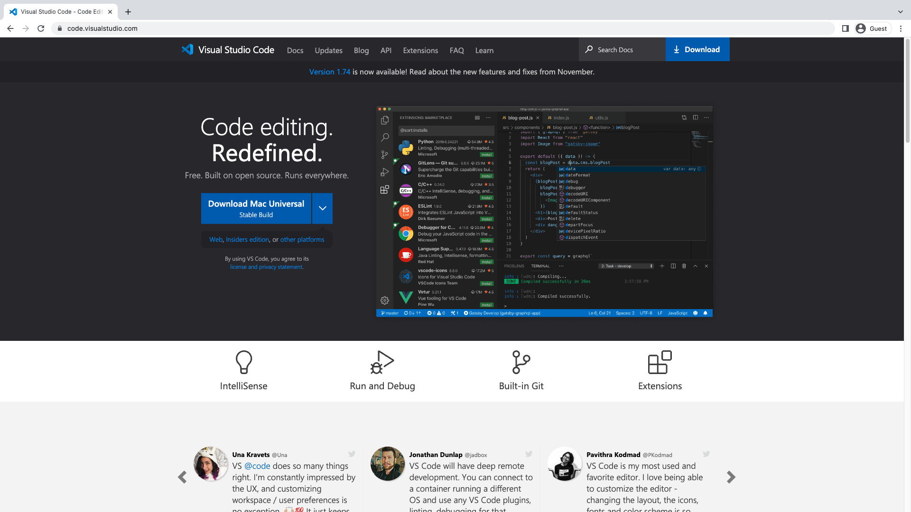
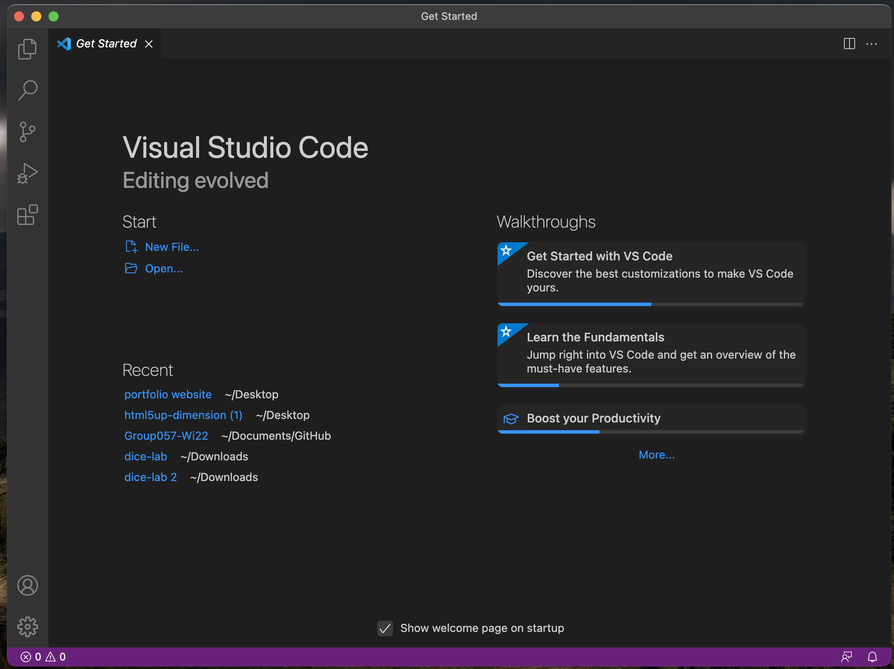
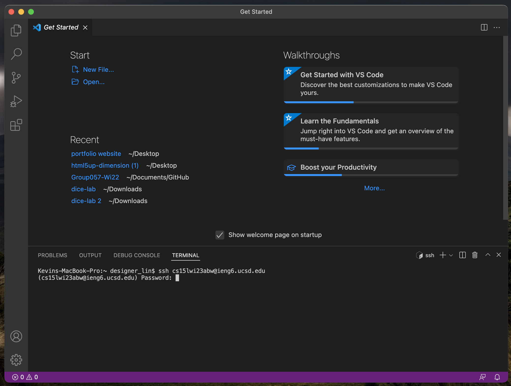
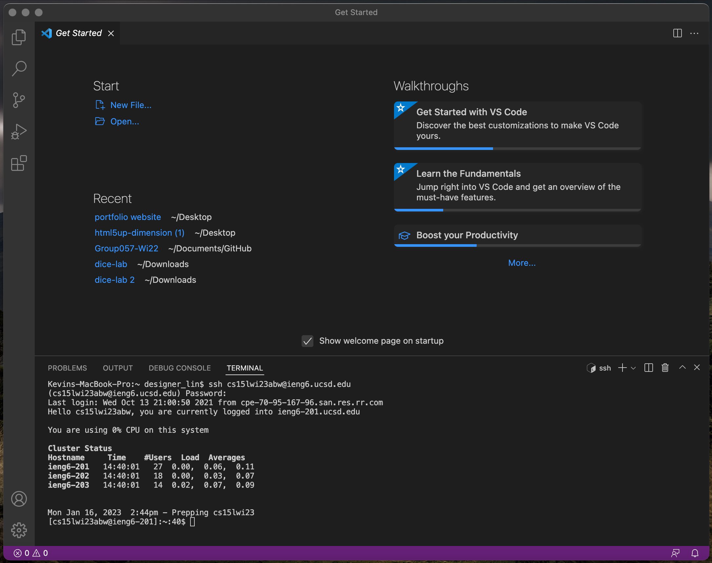

In this lab, we will use a code editor Visual Studio Code (VS Code) to connect to remote server. Users would have to download and install the VS Code on the website [Link](https://code.visualstudio.com). 

* This is the visual studio code website which users can download different versions, Windows, macOS, or Linux, of the application.
* I downloaded macOS version on my MacBook Pro.

* This is the interface of the VS Code
* I installed the VS Code and opened it on my MacBook Pro
* Users can launch the terminal by clicking on the menu “Terminal” and create a new terminal  

After downloading the application, users would have to install git, which is a source code management, to use the newly-installed git bash in VS Code. 

* To log into the course-specific account on ieng6, users would have to use command “ssh” followed by their course-specific accounts plus @ueng6.ucsd.edu (e.g., my course-specific account is “cs15lwi23abw@ieng6.ucsd.edu”). 
* If users are connecting to the server for the first time, they will get a message asking them whether they want to continue connecting to the server or not; always type yes to connect.
* After users enter yes and enter, the terminal would ask for their passwords, which are transparent and not visible due to privacy. 
* I connected to the server by using course-specific account and entered my password 

* This screenshot shows that I am connected to the server.
* It tells you the last login time, welcomes you (referring users by their course-specific account), and tells you the server that you’re logged into.

