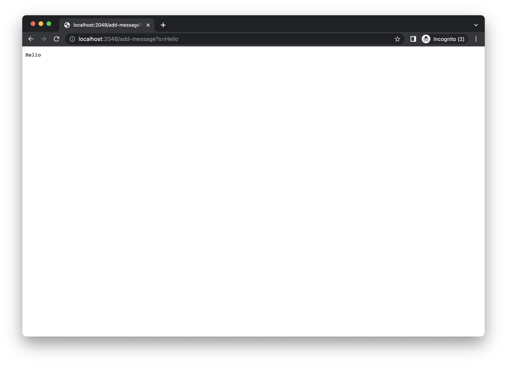
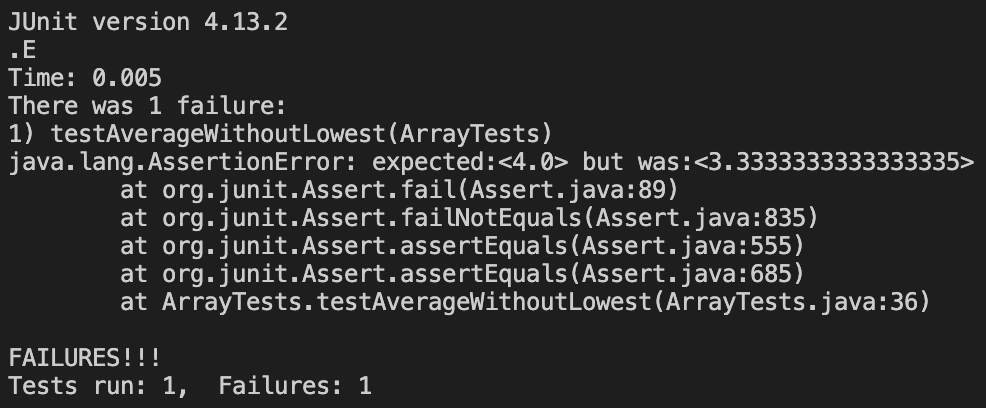
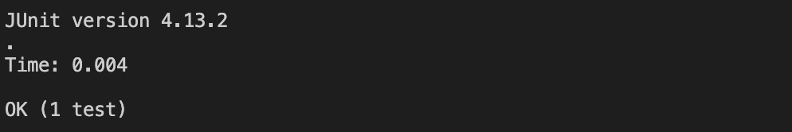

# Part 1
A web server called `String Server`
```java
import java.io.IOException;
import java.net.URI;
import java.util.ArrayList;

class Handler implements URLHandler {
    // The one bit of state on the server: a number that will be manipulated by
    // various requests.
    ArrayList<String> msg = new ArrayList<>();

    public String handleRequest(URI url) {
        if (url.getPath().equals("/")) {
            return String.format(msg.toString());
        } else if (url.getPath().contains("/add-message")) {
            String[] parameters = url.getQuery().split("=");
                if (parameters[0].equals("s")) {
                    msg.add(parameters[1]+"\n");
                }
                return String.format(msg.toString().replace("[","").replace("]","").replace(", ",""));
        }else {
            return "404 Not Found!"; 
        }
    }
}

class StringServer {
    public static void main(String[] args) throws IOException {
        if(args.length == 0){
            System.out.println("Missing port number! Try any number between 1024 to 49151");
            return;
        }

        int port = Integer.parseInt(args[0]);

        Server.start(port, new Handler());
    }
}
``` 

* This is the first screenshot using `/add-message`.
* handleRequest method is called when users input new URI.
* Relevant arguement to the method is the input URI and value of that argument is `new URI("http://localhost:2048/add-message?s=Hello")`
* The query is stored in the arrayList and the size of the arrayList is resized.


* This is the second screenshot using `/add-message`.
* handleRequest method is called when users input new URI.
* Relevant arguement to the method is the input URI and value of that argument is `new URI("http://localhost:2048/add-message?s=How%20are%20you")`
* `%20` in the URL represents encoded space.
* The query is stored in the arrayList and the size of the arrayList is resized.

# Part 2
* A failure-inducing input for the buggy program, as a JUnit test and any associated code (write it as a code block in Markdown)
```java
@Test
  public void testAverageWithoutLowest(){
    double[] input3 = {2.0,2.0,4.0,6.0};
    assertEquals(3.0, ArrayExamples.averageWithoutLowest(input3), 0.0);
  }
```

* An input that doesn’t induce a failure, as a JUnit test and any associated code (write it as a code block in Markdown)
```java
@Test
  public void testAverageWithoutLowest(){
    double[] input4 = {1.0,2.0,4.0,6.0};
    assertEquals(4.0, ArrayExamples.averageWithoutLowest(input4), 0.0);
  }
```

* The symptom, as the output of running the tests (provide it as a screenshot of running JUnit with at least the two inputs above) 

* This screenshot is the symptom of a failure-inducing input for the buggy program.  


* This screenshot is the symptom if an input for the buggy program that doesn't induce a failure.

* The bug (before)
```java
  static double averageWithoutLowest(double[] arr) {
    if(arr.length < 2) { return 0.0; }
    double lowest = arr[0];
    for(double num: arr) {
      if(num < lowest) { lowest = num; }
    }
    double sum = 0;
    for(double num: arr) {
      if(num != lowest) { sum += num; }
    }
    return sum / (arr.length - 1);
  }
```

* Code for fixing the bug
```java
static double averageWithoutLowest(double[] arr) {
    if(arr.length < 2) { return 0.0; }
    double lowest = arr[0];

    for(double num: arr) {
      if(num < lowest) { lowest = num; }
    }
    double sum = 0;
    for(double num: arr) {
      sum += num;
    }
    sum -= lowest;
    return sum / (arr.length - 1);
  }
```
* The original code uses a `for loop` to find out the smallest number in the list by looping through the entire list; by assuming the first element as the smallest number, it compares the rest of the numbers in the list with the smallest number. If the number is smaller than the smallest number, it becomes the smallest number. Later, the original code uses another `for loop` to find out the sum without the smallest number. However, the bug is that when there are multiple smallest numbers in the list, the code ignores them and doesn't add them to the sum. It leads to a bug where it might miscalculate the sum of the list without the smallest number and average. 
* The fix adresses the bug in the original code because it uses a `for loop` to find out the smallest number in the list by looping through the entire list. Later, the fixed code uses a `for loop` to sum up the entire list but subtracts the lowest number to make sure that it calculates the sum without the lowest number. Later, it is divided by the size of the list without the lowest number to find out the average without the lowest number. 

# Part 3
* Something that I learned from lab in week 2 was to use `Server.java` to set up a local running server. In addition, I also learned that by changing the port number, people who are connected to the same wifi can access my local server. By changing the paths and queries on my URLs, I can perform different actions and store the new values on local computer. 
* Something that I learned from lab in week 3 was to understand how to read the symptoms of the programs and learn how to debug them. Even though some programs might compile successfully without any symptoms, but it is important to know that there might be failure-inducing input that might trigger the bug and create a failture symptoms. 
