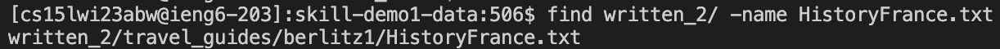
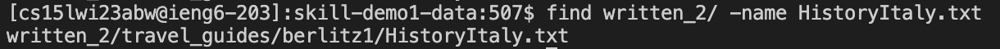
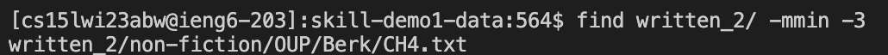
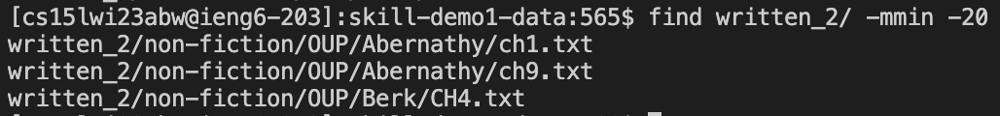
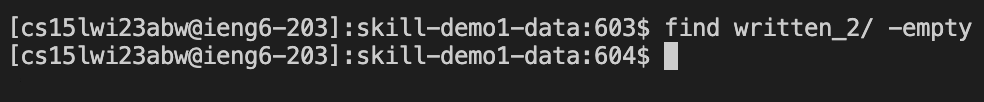
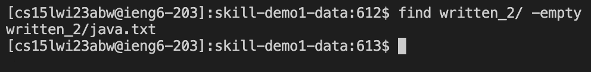
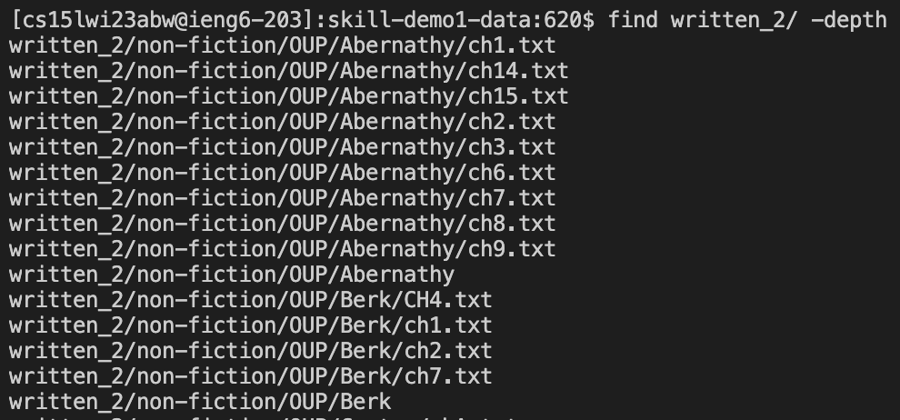

# Researching commands 

## Find `-name`
* Example 1:

* Example 2:

In these examples, I was able to search a file with a specific name in a specified directory. By using `find -name`, it searches a specific file under the specified directory and return its relative path. This command is useful because it saves users' time and quickly locate the file under the directory instead of searching where the file is located. 

Sources: [Link](https://linuxhint.com/linux-find-command-tutorial/)

## Find `-mmin -n`
* Example 1:

* Example 2:

In these examples, I was able to find files that I modified in a specified directory. By using `find -mmin -n`, it searches files that I modified under the specified directory within the last n minutes and output the reltive path of the files. This command is helpful because it outputs files that users modified within a certain time frame.

Sources: [Link](https://linuxhint.com/linux-find-command-tutorial/)

## Find `-empty`
* Example 1:

* Example 2:

In these examples, I was able to find empty files in a specified directory. The first example shows that there is no empty file in the specified directory. However, in the second example, it shows an empty file in the specified directory becasue I used `grep` trying to find java file in the specified directory and save the result to java.txt; however, since there is no java file in the specified directory, nothing gets stored in java.txt which makes it an empty file. This method is useful because it helps the users to identify empty files and users can easily organize the directories by deleting them.  

Sources: [Link](https://linuxhint.com/linux-find-command-tutorial/)

## Find `-depth`
* Example 1:

* Example 2:

In these examples, I was able to use `-depth` to get all the files in a specified directory. By using this command, it processes the directory contents before directory itself and output all the files under the specified directory; it goes to the maximum levels below the parent directory and print every files out and go to the upper level. This command is useful because it helps users to know the relative path of all the files before taking any action or helping them to make sure that there is no file under the directory that they want to delete. 

Sources: [Link](https://www.softwaretestinghelp.com/find-command-in-unix/)
