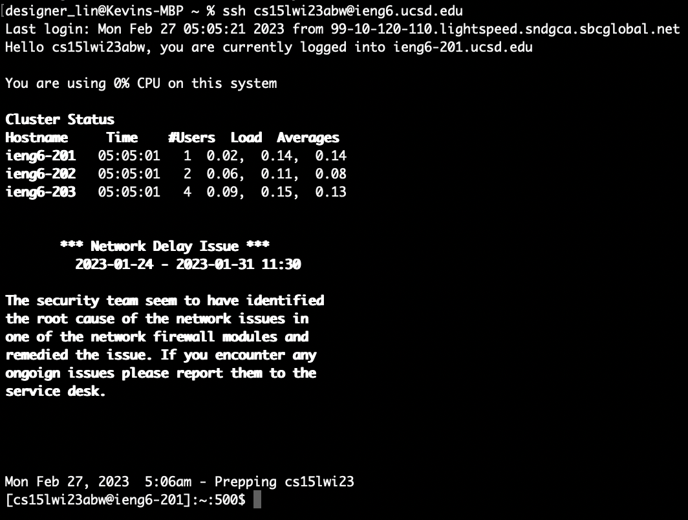
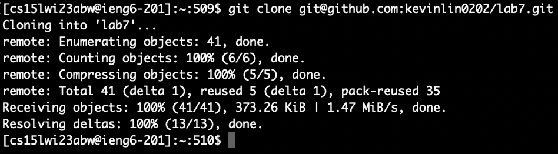
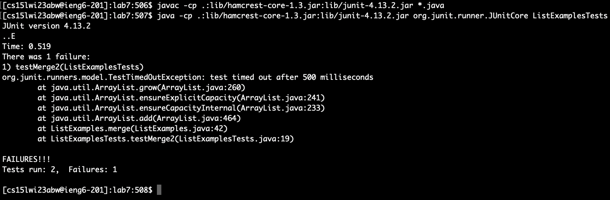
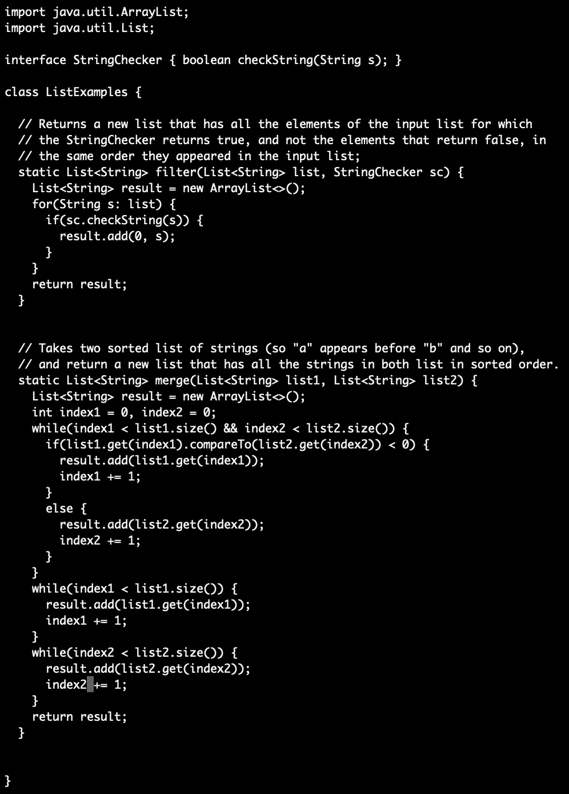
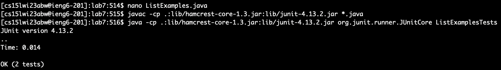
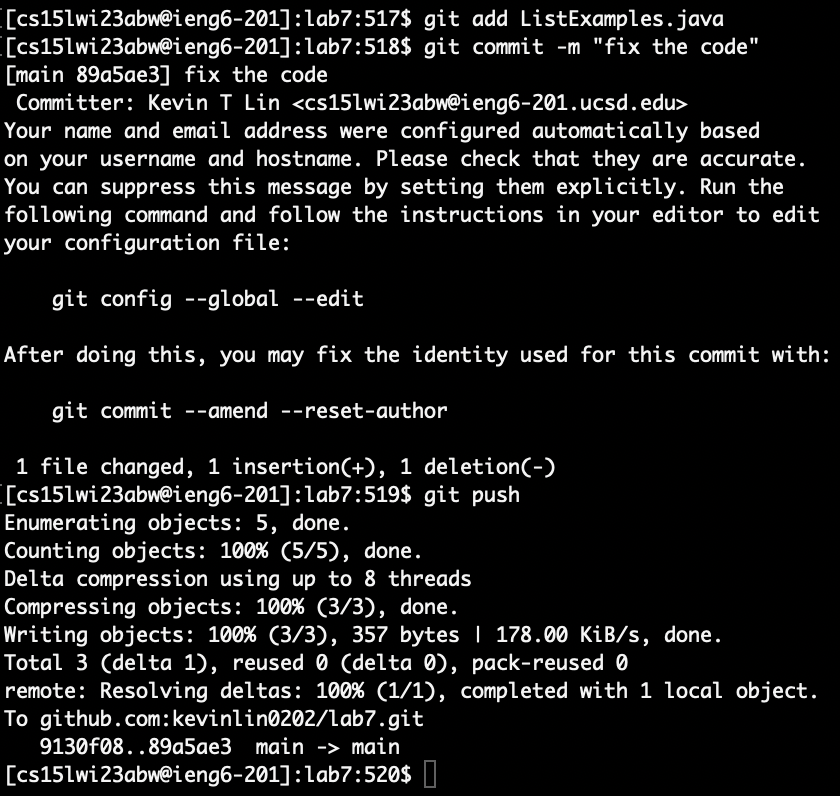

## Step 4
* 
* Keys pressed: `<up><enter>` 
* By pressing `<up>` in terminal, it allows me to recall the previous command line that I entered, which is `ssh cs15lwi23abw@ieng6.ucsd.edu`. By pressing `<enter>`, it allows me to use the key to log into my course-specific account on the remote server. 

## Step 5
* 
* Keys pressed: `<command+c><command+v><enter>` 
* I used a git clone command, `git clone` + a ssh URL to clone a repository from GitHub. Since I already generated an SSH keypair on my laptop and added the public key to my account, I am able to use SSH URLs to clone repositories. I used `<command c>` to copy ssh URL from GitHub and used `<command v>` to paste that in the terminal. After, by pressing `<enter>`, I was able to clone my repository to my course-specific account on the remote server. 

## Step 6
* 
* Keys pressed: `<command+c><command+v><enter>`,`<command+c><command+v><enter>`
* After cloning a repository, I used `cd` + repo name (lab7) to change my current directory to lab7. I used `<command+c> to copy command `javac -cp ".;lib/hamcrest-core-1.3.jar;lib/junit-4.13.2.jar" *.java` and used `<command+v>`to paste in the terminal. Then, I did the same thing with `java -cp ".;lib/junit-4.13.2.jar;lib/hamcrest-core-1.3.jar" org.junit.runner.JUnitCore ListExamplesTests`. I used `javac` to compile and `java` to run the program. Screenshot shows that JUnit Test has one failure.

## Step 7
* 
* Keys pressed: `<control(^)+_><44><left><left><left><left><left><left><left><delete><2>`,`<control(^)+o><enter><control(^)+x>`
* I used `nano` to edit my code and fix the failing test. I used `<control(^)+_>' to jump to line 44 and used left arrow to move my cursor 7 characters to the left. Later, I used `<control+o>` to save the file, `<enter>` to confirm that I am saving this file, and `<control+x>` to exit the nano editor. 

## Step 8
* 
* Keys pressed: `<up><up><up><enter>`, `<up><up><up><enter>`
* The command `javac -cp ".;lib/hamcrest-core-1.3.jar;lib/junit-4.13.2.jar" *.java` was 3 up in the search history, so I used up arrow three times to access it. Then, the command `java -cp ".;lib/junit-4.13.2.jar;lib/hamcrest-core-1.3.jar" org.junit.runner.JUnitCore ListExamplesTests` was also 3 up in the search history, so I used up arrow three times to access it again. 

## Step 9
* 
* I used `git add L<tab>.j<tab>` to add the change of the file "ListExamples.java" in the working directory to the staging area and used `git commit -m "fix the code"` to commit a short message about the changes in the working directory and used `git push` to push the change to my GitHub account. 
