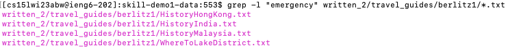
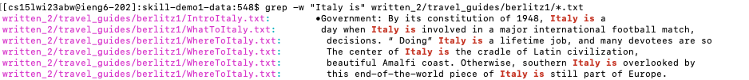
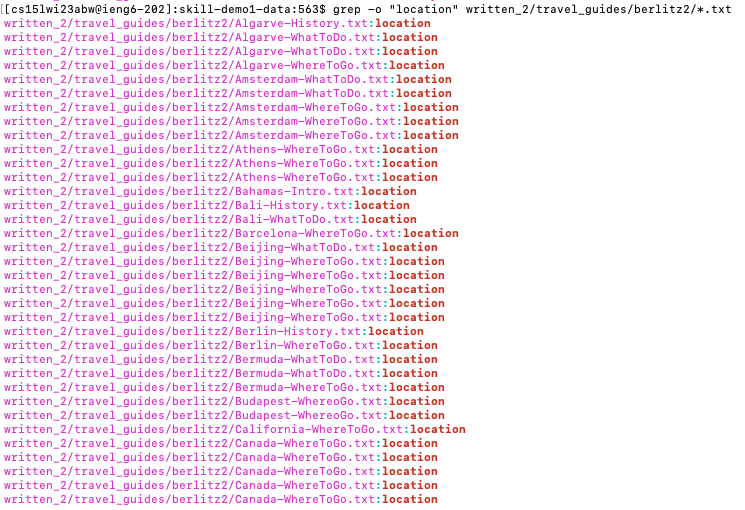

# Do the same exploration of several options for a different command or commands

## grep `-l`
* Example 1:

* Example 2:

According to the source, `grep -l` displays the list of a filenames that matches the pattern or strings only. By using this option, it allows me to find files that contain the given string or patterns. In these examples, I was able to search for specific string or patterns within a directory and find out which files contain the exact string or patterns. This command might be useful becasue it saves users' times and it shows the files names that contain the strings or pattern only once instead of showing all the lines that contain the strings or the patterns. 

Sources: [Link]([https://linuxhint.com/linux-find-command-tutorial/](https://www.geeksforgeeks.org/grep-command-in-unixlinux/))

## grep `-w`
* Example 1:

* Example 2:

According to the source, `grep -w` makes grep match only the whole words. By using this option, it allows me to find more accurate matches and increase efficiency when looking for specific terms or phrases. In these examples, I was able to search for whole words or phrases within a directory and output the passages that contain the whole words or phrases. This command might be useful becasue it saves users' time and allow them to quickly locate the file under the directory and show enough passages for users to understand the contents which included the whole words they are looking for. 

Sources: [Link]([https://linuxhint.com/linux-find-command-tutorial/](https://www.geeksforgeeks.org/grep-command-in-unixlinux/))

## grep `-i`
* Example 1:

* Example 2:

According to the source, `grep -i` enables to search for a string case "insensitively" in the given directory. By using this option, it gives me more flexibility on looking for a string or pattern. In these examples, I was able to search for strings or patterns in a case-insensitive manner and gives me more results when searching. This command might be useful because it provides more flexibility to the users for not worrying about the case sensitive and search for particular patterns within a directory. For example, when users search for "battle", the output of using `grep -i` also shows "Battle" or even words containing the particular pattern "Battleground".  

Sources: [Link]([https://linuxhint.com/linux-find-command-tutorial/](https://www.geeksforgeeks.org/grep-command-in-unixlinux/))

## grep `-o`
* Example 1:

* Example 2:

According to the source, `grep -o` displats only the matched patterns. By using this option, it only shows the matched part of the string or patterns instead of showing the entire sentences. In these examples, I was able to find matched string or pattern within a directory and the output gives separate lines for each matched string even though they are in the same file. This command might be useful when users want to know how many times this particualr words or strings appear in the directory and the system outputs the file paths with the matched string it found.

Sources: [Link]([https://linuxhint.com/linux-find-command-tutorial/](https://www.geeksforgeeks.org/grep-command-in-unixlinux/))
